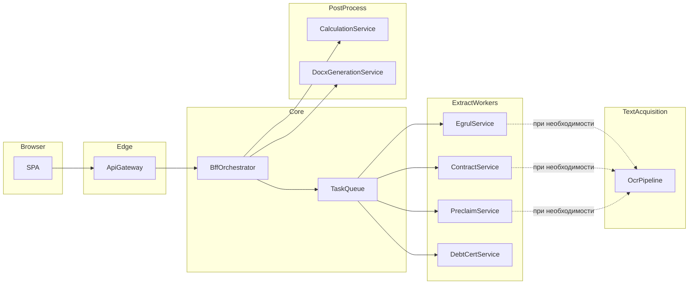

# Техническое задание: веб-сервис составления судебных исков

**Версия документа:** 1.5
**Статус:** утверждение к разработке

---

## 1. Назначение и границы системы

### 1.1. Назначение

Система предназначена для автоматизированной подготовки материалов судебного иска на основе загруженного пользователем набора документов: извлечение структурированных данных, их уточнение пользователем в браузере, выполнение расчётов (неустойка, проценты, суммы и иные правила, задаваемые предметной областью) и генерация двух документов Microsoft Word — **искового заявления** и **расчёта к иску** (приложение с расчётами).

### 1.2. Границы (вне объёма текущей версии)

- Юридическая экспертиза текста иска и соответствие актуальной судебной практике.
- Квалифицированная электронная подпись, подача документов в суд через ГАС «Правосудие» и иные государственные API.
- Ведение архива дел, роли юриста/администратора организации, многоарендность (multi-tenant), если не оговорено отдельно.
- Тонкая настройка качества OCR для аномально низкого разрешения или повреждённых сканов — допускается вынос в последующие итерации при сохранении обязательного для **PDF** пайплайна «извлечение текста → OCR» (см. раздел 4.2.1).

---

## 2. Роли и пользовательские сценарии

### 2.1. Роли

| Роль        | Описание |
|------------|----------|
| Пользователь | Физическое или юридическое лицо, формирующее иск; работает только через веб-интерфейс. |

### 2.2. Основной сценарий

1. Пользователь открывает веб-приложение в браузере (SPA).
2. Загружает **входной набор документов** (см. раздел 3): выписка ЕГРЮЛ, один или несколько комплектов (**договор** и **досудебная претензия** — в **PDF**, в типовом случае скан **без текстового слоя**; справки о задолженности в Excel: `.xls`, `.xlsx`, `.xlsm`), указывает **дату составления заявления**. Схематично структура файлов в запросе (пакете) выглядит так:

   ```
   applicationDate                    ← дата составления заявления (метаданные формы)
   egrulExtract                       ← один файл: выписка ЕГРЮЛ (.pdf)
   documentSets[]                     ← один или несколько комплектов
     └─ documentSetId / label
          ├─ contract                 ← договор (.pdf)
          ├─ preClaim                 ← досудебная претензия (.pdf)
          └─ debtCertificates[]       ← одна или несколько справок (.xls | .xlsx | .xlsm)
   ```

   Детальная логическая модель и пример JSON — в разделе 3.
3. Нажимает кнопку **«Отправить»** (или эквивалент: «Запустить извлечение»).
4. Бэкенд выполняет извлечение данных из документов (асинхронно через очередь задач и специализированные сервисы) по правилам раздела **4.2**: для **всех PDF** (ЕГРЮЛ, договор, претензия) — **извлечение текста и при необходимости OCR** (раздел 4.2.1); для **справок о задолженности (Excel)** — **готовый парсер таблиц** (раздел 4.2.2). Извлечение выполняют следующие сервисы (оркестрация и постановка задач — у BFF, раздел 6):

   - **`extract-egrul`** — выписка ЕГРЮЛ (PDF, раздел 4.2.1);
   - **`extract-contract`** — договор (PDF, раздел 4.2.1);
   - **`extract-preclaim`** — досудебная претензия (PDF, раздел 4.2.1);
   - **`extract-debt-certificate`** — справки о задолженности (Excel, раздел 4.2.2, готовый парсер);
   - **`ocr-pipeline`** — OCR страниц PDF при непригодном текстовом слое; вызывается сервисами **`extract-egrul`**, **`extract-contract`**, **`extract-preclaim`** (раздел 4.2.1 и 6.1).
5. На фронтенд возвращается **агрегированный JSON** с извлечёнными полями.
6. Веб-страница отображает данные в **редактируемых полях**. Для каждого комплекта документов, по которому извлечение не удалось или выполнено частично, рядом с соответствующим блоком полей отображается **сообщение об ошибке**; пользователь может **ввести или исправить данные вручную**.
7. Пользователь при необходимости корректирует значения на форме.
8. В конце страницы пользователь нажимает **«Произвести расчёт»**.
9. Актуальный JSON с формы отправляется на бэкенд; сервис расчётов выполняет вычисления и возвращает JSON с результатами; фронтенд **отображает результаты** (отдельный блок или интеграция в форму — по проектированию UI).
10. Пользователь нажимает **«Сгенерировать документ»**.
11. Бэкенд формирует два файла Word на основе данных с веб-страницы (и при необходимости — результатов расчёта); пользователь **скачивает оба файла**: иск и расчёт к иску.

### 2.3. Альтернативные сценарии

- **Таймаут извлечения:** отображение статуса «в обработке» с опросом или WebSocket/SSE; при ошибке — возможность повторной отправки или ручного заполнения.
- **Частичный успех:** часть полей заполнена из документов, часть — пустая; ошибки привязаны к `documentSetId` и типу документа.
- **Скан без текстового слоя:** этап прямого извлечения не даёт пригодного текста — автоматически выполняется OCR-пайплайн; при успехе пользователь видит заполненные поля так же, как для «текстового» PDF.

---

## 3. Входные данные

### 3.1. Состав набора документов (логическая модель)

Входящий набор документов состоит из:

- одной **справки (выписки) из ЕГРЮЛ**;
- **нескольких комплектов** документов, каждый комплект включает: **договор** в формате **PDF** (в типовом сценарии — скан без текстового слоя, извлечение через OCR после неуспешного чтения слоя), **досудебную претензию** в формате **PDF**, **несколько справок о задолженности** в форматах **Microsoft Excel**: `.xls`, `.xlsx`, `.xlsm`;
- **даты составления заявления**.

Ниже тот же состав представлен в виде **JSON-структуры** (логическая схема пакета после загрузки или при передаче в API оркестратора). Идентификаторы файлов (`fileRef`) — логические ссылки на объект после загрузки: путь/ключ в **локальном файловом хранилище** или идентификатор в объектном хранилище (см. раздел 6.1), в зависимости от конфигурации развёртывания.

**Формат `packageId`:** одна строка без пробелов, компоненты разделены символом подчёркивания **`_`**:

`день_месяц_год_часы_минуты_секунды_миллисекунды_XXXX`,

где **`день`**, **`месяц`**, **`год`**, **`часы`** (0–23), **`минуты`**, **`секунды`** и **`миллисекунды`** — числовые части момента создания пакета на стороне бэкенда (рекомендуется фиксированная ширина: день и месяц по две цифры с ведущим нулём при необходимости, год — четыре цифры, часы/минуты/секунды — по две цифры, миллисекунды — три цифры с ведущими нулями при необходимости); **`XXXX`** — **ровно четыре** псевдослучайных символа (латинские буквы в нижнем регистре и/или цифры) для различения пакетов, созданных в один и тот же момент по времени. Пример: `11_04_2026_14_30_05_384_k7m9`.

```json
{
  "packageId": "11_04_2026_14_30_05_384_k7m9",
  "applicationDate": "2026-04-11",
  "egrulExtract": {
    "fileRef": "files/e7b8c9d0-1111-4222-8333-444455556666",
    "originalFilename": "egrul.pdf",
    "mimeType": "application/pdf"
  },
  "documentSets": [
    {
      "documentSetId": "set-001",
      "label": "Комплект 1",
      "contract": {
        "fileRef": "files/a1b2c3d4-e5f6-7890-abcd-ef1234567890",
        "originalFilename": "dogovor_scan.pdf",
        "mimeType": "application/pdf"
      },
      "preClaim": {
        "fileRef": "files/b2c3d4e5-f6a7-8901-bcde-f12345678901",
        "originalFilename": "pretensiya.pdf",
        "mimeType": "application/pdf"
      },
      "debtCertificates": [
        {
          "fileRef": "files/c3d4e5f6-a7b8-9012-cdef-123456789012",
          "originalFilename": "spravka_zadolzhennost_1.xlsx",
          "mimeType": "application/vnd.openxmlformats-officedocument.spreadsheetml.sheet"
        },
        {
          "fileRef": "files/d4e5f6a7-b8c9-0123-def0-234567890123",
          "originalFilename": "spravka_zadolzhennost_2.xls",
          "mimeType": "application/vnd.ms-excel"
        }
      ]
    },
    {
      "documentSetId": "set-002",
      "label": "Комплект 2",
      "contract": {
        "fileRef": "files/...",
        "originalFilename": "dogovor_2.pdf",
        "mimeType": "application/pdf"
      },
      "preClaim": {
        "fileRef": "files/...",
        "originalFilename": "pretensiya_2.pdf",
        "mimeType": "application/pdf"
      },
      "debtCertificates": [
        {
          "fileRef": "files/...",
          "originalFilename": "spravka.xlsm",
          "mimeType": "application/vnd.ms-excel.sheet.macroEnabled.12"
        }
      ]
    }
  ]
}
```

### 3.2. Поддерживаемые форматы файлов

| Формат   | Расширения | Документы | Примечание |
|----------|------------|-----------|------------|
| PDF      | `.pdf`     | ЕГРЮЛ, **договор**, досудебная претензия | **Извлечение текста** из слоя PDF; при непригодном результате (в т.ч. скан без слоя) — **OCR-пайплайн** (раздел 4.2.1). Формат **Word (DOCX) для договора не используется** — входящий договор только PDF. |
| Excel    | `.xls`, `.xlsx`, `.xlsm` | **только справки о задолженности** | Извлечение данных через **готовый парсер** таблиц (раздел 4.2.2). Макросы не исполняются; используются сохранённые значения ячеек. **OCR для Excel не применяется.** |


Ограничение размера одного файла и суммарного пакета задаётся в NFR (раздел 5).

---

## 4. Функциональные требования

### 4.1. Загрузка документов

- FR-1: Пользователь может загрузить все файлы пакета через UI (multipart-загрузка или поэтапная загрузка с последующей сборкой пакета на сервере).
- FR-2: Система валидирует наличие обязательных элементов: ЕГРЮЛ, хотя бы один комплект с договором, претензией и не менее одной справки о задолженности; **договор** и **досудебная претензия** в каждом комплекте — файлы **`.pdf`**; каждая справка о задолженности — **`.xls`**, **`.xlsx`** или **`.xlsm`** (регистронезависимая проверка расширения и/или `mimeType`). Файлы договора в формате Word (**`.docx`** и др.) **не принимаются**. Иные расширения для справок отклоняются с понятным сообщением на UI.
- FR-3: Дата составления заявления вводится пользователем и входит в пакет.

### 4.2. Извлечение данных

Стратегия извлечения задаётся **типом файла**. Сервисы `extract-*` применяют только соответствующий подраздел ниже.

#### 4.2.1. Документы в формате PDF

Для всех PDF, обрабатываемых системой (**выписка ЕГРЮЛ**, **договор**, **досудебная претензия**; иных входящих PDF по настоящему ТЗ нет), данные получают из текста страниц по цепочке:

1. **Извлечение текста** — чтение текстового слоя и сопутствующей разметки страниц PDF (без OCR).
2. **Критерий пригодности** — текст считается достаточным, если удовлетворяет порогам (длина, доля значимых символов, отсутствие признаков «пустого» слоя и т.д.); пороги фиксируются в проектной документации и/или в `contracts/`.
3. **OCR-пайплайн** — если текст **не извлечён** или **не признан пригодным**, автоматически выполняется OCR: растрирование страниц, распознавание, сборка текста в порядке страниц.
4. **Структурирование** — по полученному тексту (после п.1 или п.3) выполняется извлечение полей по предметной схеме (парсинг, правила, при необходимости NER — по проекту).
5. При неуспехе после OCR — ошибка извлечения для файла/комплекта (см. FR-7). В метаданных ответа допускается указывать источник текста: `direct` (слой PDF) или `ocr`.

Вызов **ocr-pipeline** (раздел 6.1) выполняется сервисами **`extract-egrul`**, **`extract-contract`**, **`extract-preclaim`** при переходе к п.3.

#### 4.2.2. Таблицы Excel (справки о задолженности)

Для файлов **`.xls`**, **`.xlsx`**, **`.xlsm`** извлечение данных выполняется **только** с использованием **уже готового парсера** таблиц (существующая библиотека или модуль, интегрируемый в сервис `extract-debt-certificate` и/или в общий пакет `packages/` репозитория). Парсер считывает структуру книги, листов и ячеек; **макросы не исполняются**; используются сохранённые значения. Результат парсера преобразуется в поля формы согласно контракту в `contracts/`.

**OCR для Excel в настоящем ТЗ не предусмотрен.** При несовместимости файла с ожиданиями парсера, ошибке разбора или пустом результате фиксируется ошибка извлечения (FR-7) и предусмотрен ручной ввод. Версия и контракт готового парсера согласуются с заказчиком и фиксируются в зависимостях сборки.

---

- FR-4: По команде «Отправить» оркестратор создаёт задачи извлечения и ставит их в **очередь**; задачи обрабатываются **независимыми сервисами** (см. раздел 6). Для каждого файла применяется подраздел **4.2.1** (PDF) или **4.2.2** (Excel).
- FR-5: Извлечение по ЕГРЮЛ — `extract-egrul` (**4.2.1**, PDF); по договору — `extract-contract` (**4.2.1**, PDF); по досудебной претензии — `extract-preclaim` (**4.2.1**, PDF); по справкам о задолженности — `extract-debt-certificate` (**4.2.2**, несколько файлов — несколько подзадач или одна задача с массивом; форматы **`.xls`**, **`.xlsx`**, **`.xlsm`**).
- FR-6: Результаты агрегируются в **единый JSON** для фронтенда (детальная схема в `contracts/openapi` или JSON Schema). В метаданных по возможности указывается происхождение данных: для PDF (ЕГРЮЛ, договор, претензия) — `textSource`: `direct` | `ocr`; для Excel-справок — например `extractionMethod`: `excelParser` (или идентификатор версии парсера).
- FR-7: При ошибке извлечения по комплекту: в ответе присутствует объект ошибки с `documentSetId`, кодом, человекочитаемым сообщением; соответствующие поля формы могут быть пустыми; пользователь заполняет их вручную.

### 4.3. Редактирование и расчёт

- FR-8: Все отображаемые извлечённые значения редактируются на клиенте до отправки на расчёт.
- FR-9: По кнопке «Произвести расчёт» на сервер отправляется **полный актуальный JSON** состояния формы (включая ручные правки).
- FR-10: Сервис расчётов возвращает структурированный JSON результатов; UI отображает их без потери возможности вернуться к правкам и пересчитать.

### 4.4. Генерация документов

- FR-11: По кнопке «Сгенерировать документ» на сервис генерации передаётся согласованный снапшот данных (форма + при необходимости последний результат расчёта).
- FR-12: Сервис формирует **два** файла `.docx`: **исковое заявление** и **расчёт к иску** путём **подстановки данных в готовые шаблоны Word** (замена полей/плейсхолдеров); по профилю производительности (раздел 5.0) эта операция **кратковременна**. Имена файлов — по шаблону (например `isk_<packageId_short>.docx`, `raschet_<packageId_short>.docx`).
- FR-13: Клиент получает оба файла (два URL на скачивание с ограниченным временем жизни или два потока в multipart-ответе — выбирается на этапе проектирования API).

---

## 5. Нефункциональные требования

### 5.0. Профиль производительности (порядок величин задержек)

При проектировании таймаутов, очередей и масштабирования исходить из следующих допущений:

| Этап / компонент | Характер задержки | Комментарий |
|------------------|-------------------|-------------|
| Извлечение **текстового слоя** из PDF (без OCR) | Практически **мгновенно** | Чтение встроенного слоя, не CPU-ёмко. |
| **OCR-пайплайн** (`ocr-pipeline`) | **Наиболее затратно по времени** | Доминирующая стоимость в типовом пакете; основной вклад в длительность полного извлечения. |
| Извлечение из **договора** (PDF, часто скан) | Обычно **определяется OCR** | В типовом сценарии договор без текстового слоя → после мгновенной проверки слоя почти всё время уходит на OCR; **узкое место** пайплайна извлечения по сравнению с остальными PDF того же пакета. |
| **Готовый парсер** Excel (справки о задолженности) | Практически **мгновенно** | Сопоставимо с синхронным I/O и разбором книги. |
| **Расчёты** (`calculation-service`) по данным формы / справок | Практически **мгновенно** | Вычисления по уже загруженным в память данным. |
| **Генерация DOCX** (`docx-generator`) — подстановка в готовый шаблон Word | Практически **мгновенно** | Замена полей/плейсхолдеров в существующем документе, без тяжёлой вёрстки. |

Итог: **критический путь** по времени для сценария «загрузка → извлечение» — это **OCR**, в первую очередь в цепочке обработки **договора**; остальные перечисленные этапы для целей NFR можно считать краткими по сравнению с OCR.

### 5.1. Одновременная работа пользователей

- NFR-1: Система должна обеспечивать стабильную работу при **до 5 одновременных активных пользовательских сессиях** (каждая сессия — свой `packageId`, независимые задачи в очереди).
- NFR-2: **Узкое место по времени — OCR** (раздел 5.0). Долгие задачи OCR не должны блокировать синхронные API BFF и лёгкие операции: выделение **очереди** и **воркеров** для OCR в отдельный контур; **extract-debt-certificate**, **calculation-service** и **docx-generator** не требуют такой же ёмкости по CPU, как **ocr-pipeline**, при той же целевой нагрузке в 5 пользователей.
- NFR-3: Целевое время ответа для синхронных операций (валидация, сохранение черновика формы) — не более **3 с** при номинальной нагрузке 5 пользователей. Для **асинхронного** этапа извлечения верхние пределы таймаутов и индикаторы прогресса на UI **ориентировать на длительность OCR** (п. 5.0), а не на парсер Excel или чтение PDF-слоя. Рекомендация для MVP: ориентир **10–15 мин** на полный пакет при пиковой очереди OCR — настраиваемо; отдельно задать лимит ожидания в очереди на **ocr-pipeline**.
- NFR-3a: Сервис **ocr-pipeline** должен выдерживать параллельную нагрузку от до **5** активных пакетов за счёт **приоритетной** репликации и достаточной глубины очереди; нагрузка на CPU от OCR **не должна** приводить к деградации синхронных ответов BFF (изоляция воркеров, отдельные лимиты ресурсов).

### 5.2. Масштабирование и балансировка

- NFR-4: Каждый модуль извлечения документов — **отдельный сервис** с собственным образом контейнера; допускается **монорепозиторий** исходного кода при условии **независимого** сборки, развёртывания и масштабирования контейнеров.
- NFR-5: Горизонтальное масштабирование распределять **пропорционально вкладу в задержку** (раздел 5.0): в первую очередь — **реплики `ocr-pipeline`** и (при необходимости) воркеры **`extract-contract`**, обращающиеся к OCR; для **`extract-debt-certificate`**, **`calculation-service`**, **`docx-generator`** достаточно минимального числа реплик с точки зрения **отказоустойчивости** и параллелизма запросов, а не устранения CPU-бутылочного горлышка OCR. Для сервисов извлечения PDF предусмотрен **параллельный запуск нескольких экземпляров** и/или выборка задач из **общей очереди** конкурирующими воркерами.
- NFR-6: Оркестратор (BFF) не выполняет тяжёлую обработку файлов; только маршрутизация, постановка задач, агрегация результатов, доступ к **хранилищу файлов** (локальное или объектное — раздел 6.1). При агрегации результатов извлечения учитывать, что **время готовности пакета** чаще всего ограничено завершением задач с **OCR по договору** (и при необходимости по другим PDF после OCR), а не готовностью Excel-справок.

### 5.3. Надёжность и наблюдаемость

- NFR-7: Все запросы сопровождаются **correlation id** (заголовок `X-Request-Id` или аналог), пробрасываемым в логи всех сервисов.
- NFR-8: Повторный запрос расчёта с теми же данными даёт детерминированный результат (идемпотентность по опциональному ключу `Idempotency-Key` — рекомендуется).

### 5.4. Безопасность и данные

- NFR-9: Транспорт — **HTTPS** в продуктивной среде.
- NFR-10: Ограничение размера тела запроса и загружаемых файлов (рекомендация для MVP: до **50 МБ** на файл, до **500 МБ** на пакет — уточняется заказчиком).
- NFR-11: Временные файлы и результаты хранятся с **TTL** (например 24–72 ч), после чего удаляются политикой хранилища, **фоновой задачей очистки** (для локального диска) или правилами бакета в облаке. Для **локального хранилища** путь к каталогу данных задаётся конфигурацией и **не должен** пересекаться с каталогом исходного кода без явного монтирования тома.

### 5.5. Совместимость клиента

- NFR-12: Поддержка последних двух мажорных версий Chrome, Firefox, Safari, Edge на момент релиза.

---

## 6. Архитектура системы

Архитектура и развёртывание исходят из **профиля производительности** (раздел **5.0**): доминирующая задержка при извлечении приходится на **OCR**; в типовом пакете основной вклад в длительность этапа извлечения даёт обработка **договора** (скан PDF → OCR). Парсер Excel, чтение текстового слоя PDF, расчёты и подстановка данных в шаблоны Word для целей ёмкости и планирования очередей считаются **краткими** операциями.

### 6.1. Логические компоненты

| Компонент | Назначение | Нагрузка / критичность по времени |
|-----------|------------|-----------------------------------|
| **Web SPA** | UI: загрузка, форма, ошибки по комплектам, расчёт, скачивание документов. | Для длительного извлечения — индикация ожидания с учётом OCR (п. 5.0). |
| **API Gateway** | TLS-терминация, маршрутизация к BFF и (при необходимости) прямой раздаче статики; rate limiting. | Не CPU-ёмкий. |
| **BFF / Orchestrator** | Создание пакета, загрузка в хранилище, постановка задач извлечения, опрос статуса, агрегация JSON, вызов расчёта и генерации DOCX. | Агрегация «пакет готов» обычно ждёт в т.ч. **договор + OCR** (п. 5.0). |
| **Task queue** | Брокер сообщений (например RabbitMQ) или Redis Streams — задачи на извлечение по типу документа и `fileRef`; **отдельная очередь или приоритет для задач OCR** рекомендуется для учёта бутылочного горлышка. | Очередь OCR — основной буфер пиков. |
| **ocr-pipeline** | OCR и сборка текста со страниц PDF. Вызывается из **`extract-egrul`**, **`extract-contract`**, **`extract-preclaim`**, если слой PDF непригоден (раздел 4.2.1). | **Главный потребитель CPU и времени** в контуре извлечения; масштабировать **в первую очередь** (NFR-5, 6.3). |
| **extract-egrul** | Извлечение из выписки ЕГРЮЛ (PDF): раздел **4.2.1**, затем структурирование. | Слой PDF — быстро; при OCR — как у прочих PDF. |
| **extract-contract** | Извлечение из договора (**только PDF**, типично скан): раздел **4.2.1**. | **Типичный критический путь** пакета: после мгновенной попытки слоя — **OCR** (п. 5.0). |
| **extract-preclaim** | Извлечение из досудебной претензии (PDF): раздел **4.2.1**. | Аналогично ЕГРЮЛ/договору по модели; договор чаще задаёт максимум времени в комплекте. |
| **extract-debt-certificate** | Справки (**`.xls`**, **`.xlsx`**, **`.xlsm`**): раздел **4.2.2**, готовый парсер. | Практически **мгновенно** (п. 5.0); реплики — из соображений доступности, не разгрузки OCR. |
| **calculation-service** | Stateless: вход JSON формы → выход JSON расчётов. | Практически **мгновенно** (п. 5.0). |
| **docx-generator** | Два `.docx`: подстановка данных в **готовые** шаблоны Word (замена полей/плейсхолдеров). | Практически **мгновенно** (п. 5.0). |
| **Хранилище файлов** | Постоянное хранение **исходных загрузок** и **сгенерированных DOCX**. В проекте **обязательно** предусмотреть режим **локального файлового хранилища** (каталог(и) на диске сервера или смонтированный том, единый абстрактный интерфейс чтения/записи для BFF и воркеров). Опционально — тот же интерфейс поверх **объектного хранилища** (MinIO, S3-совместимое API) для продуктивных или распределённых сред. | I/O; не сравнимо по вкладу с OCR. |

### 6.2. Диаграмма потоков (логическая)



**Пояснение к задержкам:** узел **OcrPipeline** и цепочка **ContractService → OCR** задают **максимальное время** ожидания при извлечении в типовом сценарии; **DebtCertService** (Excel), **CalculationService** и **DocxGenerationService** на диаграмме соответствуют **коротким** операциям (раздел 5.0).

### 6.3. Балансировка и параллелизм

- Репликация и глубина очередей проектируются исходя из того, что **ocr-pipeline** — основной потребитель CPU и времени; **`extract-contract`** в типовом случае наиболее часто инициирует длительные вызовы OCR (разделы 5.0, 6.1).
- Для **`extract-debt-certificate`**, **`calculation-service`**, **`docx-generator`** достаточно числа реплик, обеспечивающего **доступность** и лёгкий параллелизм до 5 сессий, без требования симметрии с **`ocr-pipeline`** по количеству воркеров.
- Минимальная конфигурация для NFR по 5 пользователям (ориентир, уточняется нагрузочным тестом): **не менее 2 реплик `ocr-pipeline`** (при необходимости **больше**, если очередь OCR растёт быстрее целевого SLA); **не менее 2 реплик** для сервисов **`extract-egrul`**, **`extract-contract`**, **`extract-preclaim`** при выносе OCR в отдельный сервис — чтобы не блокировать постановку задач; для **Excel-парсера**, **расчётов** и **генерации DOCX** — **по 1–2 реплики** с запасом по отказу узла, если не требуется иное. Очередь задач на OCR — с достаточной глубиной и мониторингом времени ожидания.

---

## 7. Контракты API (REST, версия v1)

Базовый префикс: `/api/v1`. Формат тела — `application/json`, кроме загрузки файлов.

| Метод и путь | Назначение |
|--------------|------------|
| `POST /packages` | Создание пакета: метаданные + опционально multipart файлы; ответ содержит `packageId`. |
| `POST /packages/{packageId}/files` | Дозагрузка файла (если используется поэтапная загрузка); ответ — `fileRef`. |
| `POST /packages/{packageId}/extract` | Запуск пайплайна извлечения по текущему составу пакета. |
| `GET /packages/{packageId}/extraction` | Статус и при готовности — агрегированный JSON полей + массив ошибок по комплектам/типам. |
| `PUT /packages/{packageId}/form` | Сохранение черновика отредактированной формы (опционально, для восстановления сессии). |
| `POST /packages/{packageId}/calculate` | Тело: JSON формы; ответ: JSON результатов расчёта. |
| `POST /packages/{packageId}/documents` | Тело: JSON формы (+ ссылка на последний расчёт при необходимости); ответ: два `downloadUrl` с TTL или идентификаторы артефактов. |
| `GET /artifacts/{artifactId}` | Скачивание готового файла (если используется двухфазная выдача). |

Коды ошибок: единый формат `{ "error": { "code", "message", "details" } }`. Для частичного успеха извлечения HTTP 200 с заполненным массивом `extractionErrors`.

---

## 8. Модели JSON (обзор)

### 8.1. Пакет входных файлов

Соответствует разделу 3 (корневые поля `packageId`, `applicationDate`, `egrulExtract`, `documentSets[]`). Формат значения `packageId` — см. раздел 3.1.

### 8.2. Ответ после извлечения (пример фрагмента)

```json
{
  "packageId": "11_04_2026_14_30_05_384_k7m9",
  "applicationDate": "2026-04-11",
  "form": {
    "plaintiff": { "name": "ООО Пример", "ogrn": "1234567890123" },
    "defendant": { "name": "ООО Ответчик" },
    "claims": []
  },
  "documentSetResults": [
    {
      "documentSetId": "set-001",
      "status": "partial",
      "extracted": {
        "contractNumber": "45/2025",
        "debtAmount": "100000.00"
      },
      "textProvenance": {
        "contract": "ocr",
        "preClaim": "ocr",
        "debtCertificates": ["excelParser", "excelParser"]
      },
      "errors": [
        {
          "source": "preClaim",
          "code": "EXTRACTION_FAILED",
          "message": "Не удалось извлечь дату претензии автоматически"
        }
      ]
    }
  ],
  "egrul": { "status": "ok", "errors": [] }
}
```

### 8.3. Результат расчёта (пример)

```json
{
  "packageId": "11_04_2026_14_30_05_384_k7m9",
  "calculatedAt": "2026-04-11T12:00:00Z",
  "lines": [
    { "label": "Основной долг", "amount": "100000.00" },
    { "label": "Неустойка", "amount": "15000.00" }
  ],
  "totals": { "grandTotal": "115000.00" }
}
```

Точный состав полей `form`, правил расчёта и маппинга на шаблоны DOCX фиксируется в **JSON Schema / OpenAPI** в каталоге `contracts/`.

---

## 9. Целевая структура проекта (репозиторий)

Игнорируется существующая структура текущего репозитория; ниже — **целевая** раскладка для новой кодовой базы сервиса.

```
legal-doc-claim-service/
├── apps/
│   └── web/                      # SPA (фронтенд)
├── services/
│   ├── bff-orchestrator/         # API для UI, оркестрация, агрегация
│   ├── extract-egrul/
│   ├── extract-contract/
│   ├── extract-preclaim/
│   ├── extract-debt-certificate/
│   ├── ocr-pipeline/             # OCR для PDF; вызывается extract-egrul / extract-contract / extract-preclaim при необходимости
│   ├── calculation-service/
│   └── docx-generator/
├── packages/                     # опционально: общие библиотеки (типы, клиенты)
│   ├── shared-types/
│   └── debt-certificate-parser/  # опционально: обёртка/типы над готовым парсером Excel для 4.2.2
├── contracts/
│   ├── openapi/                  # openapi.yaml — единый или разбитый по сервисам
│   └── json-schema/              # схемы form, extraction, calculation
├── infra/
│   ├── docker-compose.yml        # локальный стенд: gateway, bff, queue, extract-*, ocr-pipeline; том/каталог для локального data/
│   ├── data/                     # опционально: .gitignore; монтируемый каталог для локального хранилища файлов (см. 6.1)
│   └── k8s/                      # опционально: манифесты для продуктива
├── docs/
│   └── TecnicalSpecification.md  # копия или ссылка на данное ТЗ при переносе
└── README.md
```

Требование: **каждый каталог в `services/*`** — отдельный деплойный артефакт (свой `Dockerfile`, свои переменные окружения, независимое масштабирование).

Требование к **хранилищу файлов** (см. раздел 6.1): в кодовой базе предусмотреть **единый контракт** доступа к файлам (чтение/запись/удаление по `fileRef`) с **обязательной** реализацией **локального файлового хранилища** (корневой каталог задаётся конфигурацией, например переменная окружения `STORAGE_ROOT` или путь в `infra/data/` при docker-compose). Реализация поверх **объектного** API (MinIO, S3) — **опционально** как альтернативный бэкенд того же контракта.

---

## 10. Критерии приёмки

1. Пользователь может пройти сценарий из раздела 2.2 от начала до скачивания двух DOCX без обращения к разработчику.
2. При симуляции ошибки извлечения по одному из комплектов UI показывает сообщение об ошибке у соответствующего блока; остальные комплекты отображаются корректно; ручной ввод сохраняется и участвует в расчёте и генерации.
3. «Произвести расчёт» возвращает валидный JSON и отображается на странице; повторный расчёт после правки формы обновляет результат.
4. «Сгенерировать документ» выдаёт два файла, открываемых в Microsoft Word / LibreOffice без ошибок структуры.
5. Нагрузочный сценарий: **5 параллельных** полных циклов (загрузка → извлечение → расчёт → генерация) завершаются без необработанных ошибок 5xx и без дедлоков; время ожидания в пределах таймаутов, согласованных с **профилем производительности** (раздел 5.0) и конфигурацией **6.3** (в первую очередь ёмкость **ocr-pipeline** и очередь OCR).
6. Логи по произвольному `X-Request-Id` находятся во всех задействованных сервисах.
7. Для загруженного PDF **без** пригодного текстового слоя извлечение полей завершается успешно за счёт **OCR-пайплайна** (после неуспешного прямого извлечения); в метаданных ответа или логах отражается использование OCR для данного файла.
8. Для справки о задолженности в формате **`.xlsx`** (или **`.xls` / `.xlsm`**) поля заполняются результатом **готового парсера** (раздел 4.2.2), макросы не исполняются; при загрузке файла с неподдерживаемым расширением для справки валидация отклоняет файл с сообщением на UI.
9. **Договор** принимается **только как PDF**; попытка загрузить договор в формате Word (**`.docx`** и др.) отклоняется валидацией (FR-2). Для PDF-скана договора без текстового слоя извлечение полей возможно за счёт OCR (раздел 4.2.1).
10. При развёртывании с **локальным хранилищем** (разделы 6.1, 9) полный сценарий загрузки, извлечения, генерации и скачивания DOCX выполняется **без обязательной** зависимости от внешнего объектного хранилища (S3/MinIO).

---

## 11. Открытые вопросы на согласование с заказчиком

- Точные формулы и правовые параметры расчёта (ставки, периоды, округление).
- Пороги пригодности текста после извлечения слоя PDF (п. 4.2.1) и выбор движка/модели OCR; версия и поставщик **готового парсера** Excel (п. 4.2.2).
- Политика аутентификации (без авторизации / базовая / SSO).
- Срок хранения персональных данных и соответствие 152-ФЗ.

---

*Конец документа.*
